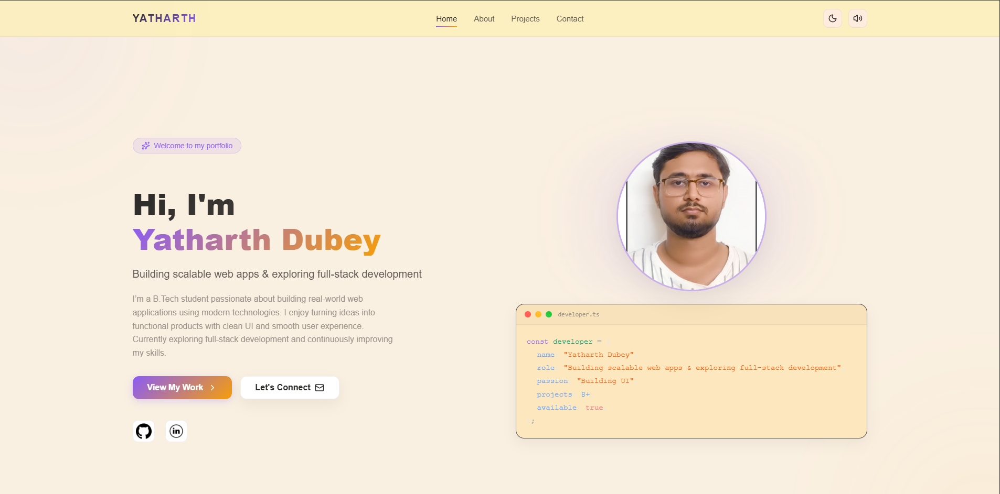
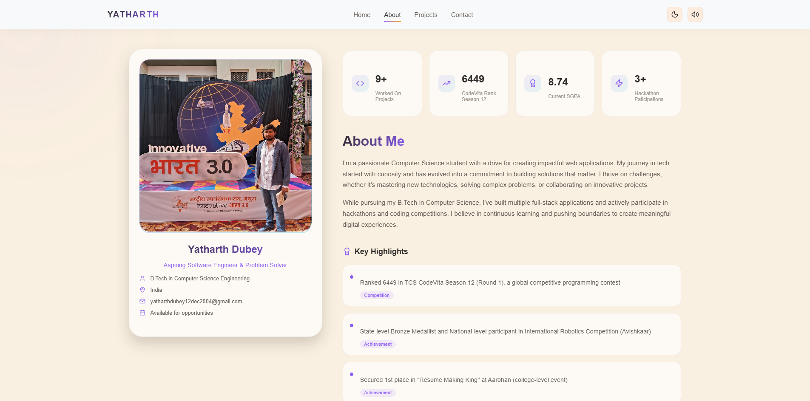
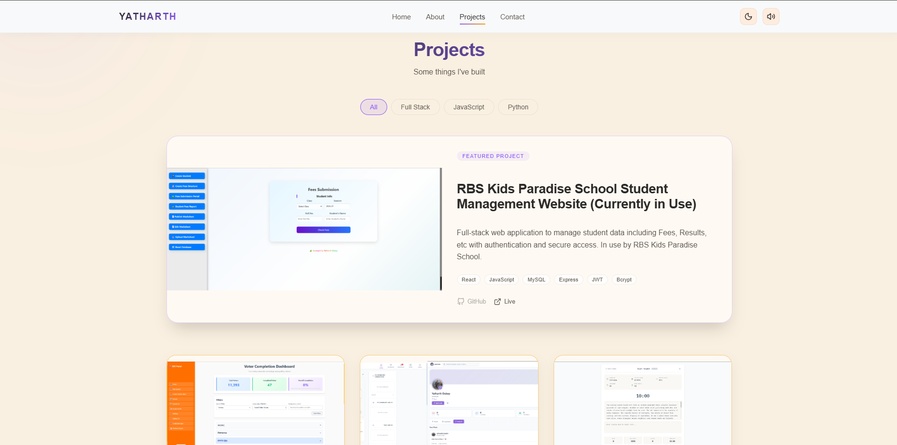

# 👨‍💻 Yatharth Dubey — Portfolio

🚀 Aspiring Software Engineer | Full-Stack Developer | Problem Solver  

A modern, responsive portfolio showcasing my projects, skills, and journey in software development.

---

## 🌐 Live Demo

👉 https://yatharthdubey.vercel.app/

---

## 🧠 About Me

I’m a passionate Computer Science student with a strong drive for building impactful web applications.  
My journey started with curiosity and has grown into a commitment to solving real-world problems through technology.

I actively build full-stack applications, participate in hackathons, and continuously improve my problem-solving skills through competitive programming.

---

## 📊 Highlights

- 🏆 Ranked **6449 in TCS CodeVita Season 12 (Round 1)**
- 🤖 State-level Bronze Medalist in **International Robotics Competition (Avishkaar)**
- 🥇 1st Place in *Resume Making King* (College Event)
- 💡 Participated in **IBM Hackathon 2025**
- ✅ Completed **HENNGE Backend Challenge** (API + Authentication + Recursion)

---

## 🛠️ Tech Stack

### 💻 Languages & Core
- JavaScript
- TypeScript
- Python
- C / C++

### 🌐 Web Development
- React
- Node.js
- Express.js
- HTML, CSS

### 🗄️ Database
- MongoDB
- MySQL

### 🔐 Authentication & APIs
- JWT Authentication
- Google OAuth
- REST APIs

### ⚙️ Tools & Platforms
- Git & GitHub
- Docker
- Postman
- Vercel
- Linux & Windows

---

## 💼 Experience

### 🏢 Full-Stack Intern — Pulse by OptiMaxin

- Contributed to real-world product development
- Worked across frontend and backend features
- Collaborated with team members effectively
- Recognized for code quality and reliability

---

## 🎓 Education

- 🎓 **B.Tech Computer Science Engineering** (2023 – Present)  
  → Current SGPA: **8.74**

- 📘 Class 12th — 77% (2023)  
- 📗 Class 10th — 94% (2021)

---

## 📈 Stats

- 🚀 9+ Projects Built  
- 🧠 Active in Competitive Programming  
- ⚡ 3+ Hackathon Participations  

---

## 🛤️ My Journey

- ✨ **2023** — Started coding & web development  
- 🏆 **2024–25** — Hackathons & competitions  
- 💻 **2025–26** — Built full-stack applications  
- 📈 **Now** — Focused on advanced development & problem solving  

---

## 📸 Screenshots

<p align="center">
  
  
  
</p>

---

## ⚙️ Installation

```bash
git clone https://github.com/Yatharth-Dubey/portfolio
cd portfolio
npm install
npm start